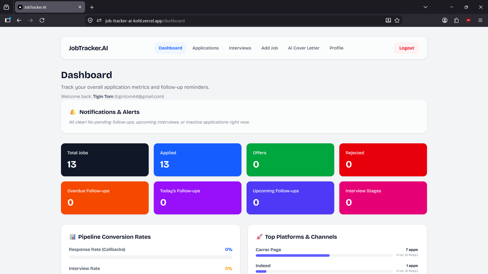
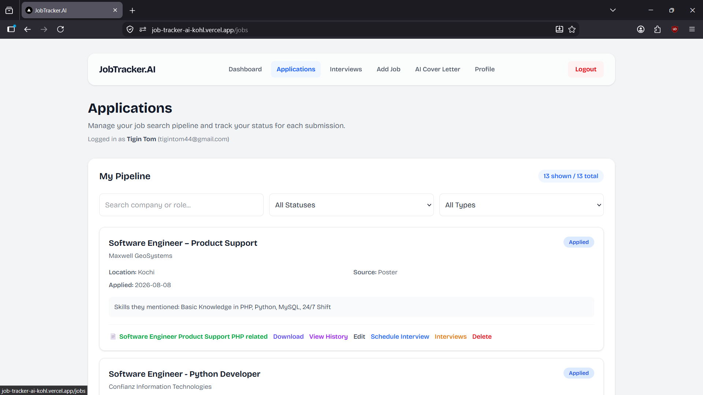
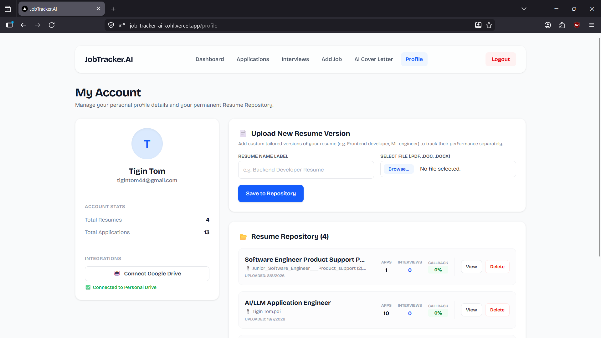
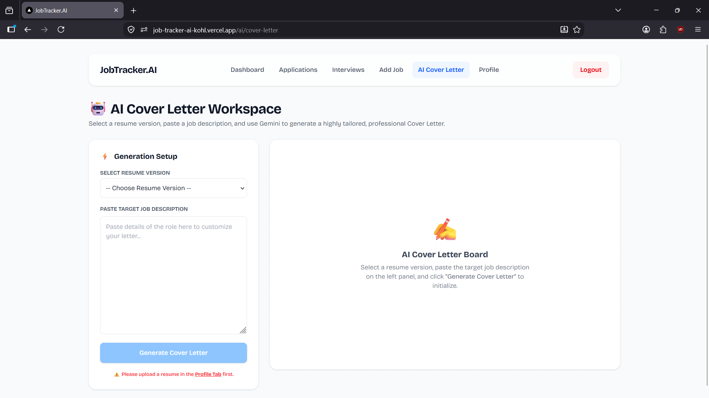

# 💼 Job Tracker AI — Backend

FastAPI backend for **Job Tracker AI**, an AI-powered platform designed to help job seekers manage applications, resumes, interviews, follow-ups, and AI-assisted job preparation.

The backend provides REST APIs for authentication, job application tracking, resume management, interview scheduling, automated reminders, AI-powered resume analysis, and tailored cover-letter generation.

## 📸 Screenshots

### Dashboard



### Job Application Tracking



### Resume Management




### AI Cover Letter Generation




## 🚀 Features

- 🔐 JWT-based user authentication
- 🔒 Bcrypt password hashing
- 🔑 Password reset using OTP via email
- 💼 Job application management
- 📊 Application status tracking and history
- 📄 Multiple resume version management
- 🤖 AI-powered resume analysis
- 🎯 Job description and resume matching
- ✍️ AI-generated tailored cover letters
- 🧠 AI-generated interview preparation questions
- 📅 Interview round scheduling
- 🔔 Follow-up and inactivity alerts
- ⏰ Automated daily email notifications
- ☁️ Google Drive integration for resume storage
- 💾 Local storage fallback
- 🗄️ PostgreSQL database
- 🔄 RESTful API architecture
- 🐳 Dockerized deployment

---

## 🧠 AI Features

### Resume & Job Description Analysis

Users can select a resume and provide a target job description.

The AI analyzes the resume against the job requirements and generates structured results including:

- ATS score
- Job match percentage
- Missing keywords
- Skills gaps
- Resume improvement suggestions
- Interview preparation questions

The analysis uses **Google Gemini 2.5 Flash** with structured JSON output.

### ✍️ AI Cover Letter Generation

The backend can generate a tailored cover letter using:

- Candidate resume content
- Target job description
- Candidate experience and skills

---

## 🏗️ Backend Architecture

```text
                    ┌─────────────────────┐
                    │     Next.js Client  │
                    │      (Frontend)     │
                    └──────────┬──────────┘
                               │
                            HTTPS
                               │
                               ▼
                    ┌─────────────────────┐
                    │    FastAPI Backend  │
                    │       REST API      │
                    └──────────┬──────────┘
                               │
              ┌────────────────┼────────────────┐
              │                │                │
              ▼                ▼                ▼
      ┌──────────────┐ ┌──────────────┐ ┌──────────────┐
      │ PostgreSQL   │ │ Google Drive │ │ Gemini API   │
      │   Database   │ │   Storage    │ │    (LLM)     │
      └──────────────┘ └──────────────┘ └──────────────┘
              │                │
              │                ▼
              │         Local Disk Fallback
              │
              ▼
       Application Data
```

## 🔄 Application Workflow

```text
User
  │
  ▼
Next.js Frontend
  │
  │ HTTP + JWT
  ▼
FastAPI Backend
  │
  ├── Authentication
  ├── Job Management
  ├── Resume Management
  ├── Interview Scheduling
  ├── Reminder System
  └── AI Services
          │
          ▼
     Gemini 2.5 Flash
          │
          ▼
      AI Response
          │
          ▼
      PostgreSQL
```

---

## 🛠️ Technology Stack

### Backend

- Python 3.11
- FastAPI
- SQLAlchemy
- Pydantic
- APScheduler

### Database

- PostgreSQL
- Supabase
- SQLAlchemy ORM

### AI

- Google Gemini 2.5 Flash
- Structured JSON generation
- Resume and job-description analysis
- Cover-letter generation
- Interview preparation generation

### Authentication & Security

- JWT
- Bcrypt
- OAuth 2.0
- Google OAuth / PKCE

### Storage

- Google Drive API
- Local filesystem fallback

### Email

- Gmail SMTP
- Automated email notifications

### Deployment

- Docker
- Hugging Face Spaces

---

## 🔐 Authentication

The API uses JWT bearer authentication.

### Authentication Flow

```text
User Login
    │
    ▼
FastAPI
    │
    ├── Verify email/password
    ├── Validate Bcrypt password hash
    │
    ▼
Generate JWT
    │
    ▼
Frontend stores access token
    │
    ▼
Authorization: Bearer <token>
```

Protected endpoints use FastAPI dependencies to validate the authenticated user before processing requests.

---

## 💼 Job Application Tracking

Users can create and manage job applications containing:

- Company
- Job role
- Job URL
- Location
- Application source
- Application status
- Applied date
- Follow-up date
- Notes
- Associated resume

Application status changes are recorded in a dedicated history table.

### Example Application Pipeline

```text
Applied
   ↓
Callback Received
   ↓
Aptitude Test
   ↓
Technical Interview
   ↓
HR Interview
   ↓
Final Interview
   ↓
Offer Received
```

---

## 📄 Resume Management

Users can maintain multiple resume versions and associate a specific resume with individual job applications.

The system calculates resume-level statistics such as:

- Number of applications
- Interview count
- Callback rate

Resumes can be stored using Google Drive when connected, with local filesystem storage available as a fallback.

---

## 📅 Interview Scheduling

Users can schedule multiple interview rounds for their applications.

Each interview can contain:

- Round type
- Interview date
- Location type
- Meeting link
- Location
- Preparation notes

---

## 🔔 Automated Alerts

The backend calculates several types of job-search alerts.

### Follow-up Alerts

Applications with follow-up dates that are due or overdue.

### Inactivity Alerts

Active applications that have not been updated for **10 or more days**.

### Upcoming Interview Alerts

Interviews scheduled within the next **3 days**.

### Daily Email Digest

APScheduler runs a scheduled background job at **8:00 AM** to generate and send active alerts through email.

---

## ☁️ Google Drive Storage

The backend provides optional Google Drive integration for resume storage.

```text
Resume Upload
      │
      ▼
Google Drive Connected?
      │
   ┌──┴───┐
  YES     NO
   │       │
   ▼       ▼
Google   Local
Drive    Storage
```

When Google Drive authorization is available, resumes are stored in the user's `JobTrackerAI` Drive folder.

If Google Drive is not connected, the application falls back to local backend storage.

---

## 🗄️ Database Design

The main database entities include:

```text
Users
  │
  ├── Jobs
  │     │
  │     ├── Job Status History
  │     └── Interviews
  │
  ├── Resumes
  │
  └── User OTPs
```

### Main Tables

| Table | Purpose |
|---|---|
| `users` | User accounts and authentication data |
| `jobs` | Job application information |
| `resumes` | Resume versions |
| `interviews` | Scheduled interview rounds |
| `job_status_history` | Application status transition history |
| `user_otps` | Password-reset OTP information |

Relationships use foreign keys and cascade/set-null rules where appropriate.

---

## 📡 API Endpoints

### Authentication

```text
POST /auth/signup
POST /auth/login
GET  /auth/me
GET  /auth/google/login-url
GET  /auth/google/callback
```

### Jobs

```text
POST /jobs/
GET  /jobs/
PUT  /jobs/{job_id}
GET  /jobs/{job_id}/history
```

### Resumes

```text
POST /resumes/
GET  /resumes/
POST /resumes/{resume_id}/analyze
```

### AI

```text
POST /ai/cover-letter
```

### Alerts

```text
GET /reminders/alerts
```

---

## 📁 Project Structure

```text
backend/
│
├── app/
│   ├── api/
│   │   └── routes/
│   │
│   ├── constants/
│   │
│   ├── core/
│   │
│   ├── db/
│   │
│   ├── models/
│   │
│   ├── schemas/
│   │
│   ├── services/
│   │
│   └── main.py
│
├── alembic/
│
├── requirements.txt
├── Dockerfile
└── .gitignore
```

---

## 🛠️ Installation & Setup

### Prerequisites

Make sure the following are installed:

- Python 3.11+
- Node.js
- npm
- PostgreSQL
- Git

### 1. Clone the repository

git clone https://github.com/Tigin-T-om/Job-Tracker-AI.git

cd Job-Tracker-AI

### 2. Backend Setup

cd backend

python -m venv .venv

Windows:

.venv\Scripts\activate

Linux/macOS:

source .venv/bin/activate

Install dependencies:

pip install -r requirements.txt

Create .env

DATABASE_URL=your_database_url
SECRET_KEY=your_secret_key
GEMINI_API_KEY=your_gemini_api_key

GOOGLE_CLIENT_ID=your_google_client_id
GOOGLE_CLIENT_SECRET=your_google_client_secret

SMTP_HOST=smtp.gmail.com
SMTP_PORT=587
SMTP_USERNAME=your_email
SMTP_PASSWORD=your_app_password

Then run

uvicorn app.main:app --reload

Backend: http://localhost:8000

### Frontend Setup

Open another terminal:

cd frontend

npm install

npm run dev

Frontend: http://localhost:3000

## 🐳 Running with Docker

Build the image:

```bash
docker build -t job-tracker-backend .
```

Run the container:

```bash
docker run -p 7860:7860 job-tracker-backend
```

The FastAPI application runs on port `7860` for Hugging Face Spaces deployment.

---

## ⚙️ Environment Variables

Create a `.env` file containing the required configuration:

```env
DATABASE_URL=
SECRET_KEY=
GEMINI_API_KEY=

GOOGLE_CLIENT_ID=
GOOGLE_CLIENT_SECRET=

SMTP_HOST=
SMTP_PORT=
SMTP_USERNAME=
SMTP_PASSWORD=
```

**Never commit `.env` files or API keys to GitHub.**

---

## 🌐 Deployment

The current deployment architecture is:

```text
Frontend
   │
   ▼
Vercel
   │
   │ HTTPS
   ▼
FastAPI Backend
   │
   ▼
Hugging Face Spaces
   │
   ├── Supabase PostgreSQL
   ├── Google Drive
   └── Google Gemini
```

---

## ⚠️ Current Limitations

The project is actively being developed. Current limitations include:

- No automated unit/integration test suite yet.
- Resume upload validation can be improved.
- AI services currently depend primarily on Gemini availability.
- Google Drive OAuth state storage requires improvement for horizontally scaled deployments.
- Authentication and CORS configuration require further production hardening.
- Some AI and analytics functionality can be expanded in future versions.

---

## 🔮 Future Improvements

- Automated unit and integration testing
- Improved authentication and token management
- Better production security configuration
- More advanced resume-job matching
- Additional AI providers and fallback models
- Improved analytics dashboards
- Advanced interview preparation
- Better notification customization
- Scalable cloud file storage
- Improved multi-user deployment architecture

---

## 👨‍💻 Author

**TIGIN TOM**

MCA Graduate | Python Developer | Backend & AI/ML Enthusiast

- GitHub: https://github.com/Tigin-T-om
- LinkedIn: https://www.linkedin.com/in/tigintom
